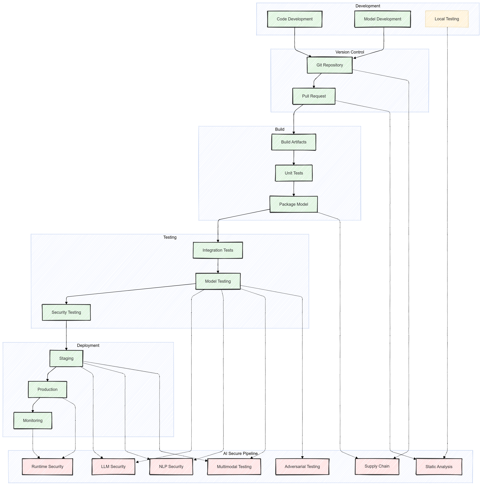

# AI Secure Pipeline (AISP)

A modular and comprehensive framework to safeguard AI models and inference endpoints against emerging threats, integrating into DevSecOps pipelines like Jenkins, GitHub Actions and SonarQube. 

## Features

1. **Static Model Analysis**: Detect unsafe code and malicious payloads in serialized AI model files.
2. **Adversarial Robustness Testing**: Evaluate and strengthen AI models against adversarial attacks.
3. **LLM-Specific Security**: Mitigate vulnerabilities like prompt injection, memory attacks, and data leakage in Large Language Models (LLMs).
4. **NLP Model Security**: Perform adversarial testing and data augmentation for NLP systems.
5. **Multimodal Robustness Testing**: Assess performance across text, image, audio, and video data types.
6. **Supply Chain Integrity**: Monitor and validate AI/ML artifact integrity throughout CI/CD pipelines.
7. **Deployment Monitoring**: Detect real-time threats and anomalies in inference endpoints.
8. **Modular Integration**: Each module can operate independently or integrate into a unified pipeline with configuration management tools.

## Modules Overview

Each module addresses critical security dimensions, detailing the types of attacks and capabilities supported. Each module is designed for independent execution but can be integrated into a comprehensive pipeline for enhanced security.

**1. [Static Model Analysis](modules/static-analysis/README.md)**
- **Objective**: Ensure serialized model artifacts are safe before deployment.
- **Tools**: [Protect AI's ModelScan](https://github.com/protectai/modelscan).
- **Capabilities**:
    - Scans for unsafe deserialization patterns, backdoors, and malicious payloads.
    - Validates code integrity in formats like Pickle and H5.
- **Attack Types**:
    - Payload Injection: Embedding harmful scripts in model serialization files.
    - Backdoor Injections: Maliciously trained triggers that affect predictions.

**2. [Adversarial Robustness Testing](modules/adversarial-testing/README.md)**
- **Objective**: Identify and mitigate vulnerabilities in AI models.
- **Tools**: [Adversarial Robustness Toolbox (ART)](https://github.com/Trusted-AI/adversarial-robustness-toolbox)
- **Capabilities**:
    - Simulates adversarial attack scenarios to evaluate robustness.
    - Provides recommendations for improving resistance to evasion and poisoning.
- **Attack Types**:
    - Evasion Attacks: Manipulating inputs to bypass detection (e.g., adversarial examples).
    - Poisoning Attacks: Introducing malicious data during training to corrupt the model.
    - Model Extraction: Reverse-engineering model outputs to reconstruct its structure.

**3. [LLM-Specific Security](modules/llm-security/README.md)**
- **Objective**: Address security challenges unique to generative models like GPT and BERT.
- **Tools**: [NVIDIA Garak](https://github.com/NVIDIA/garak)
- **Capabilities**:
    - Detects and mitigates prompt injection, token manipulation, and output-based leakage.
    - Secures memory management to prevent user-data exposure.
- **Attack Types**:
    - Prompt Injection: Manipulating input to produce unintended outputs.
    - Memory Attacks: Exploiting cached states to extract private data.
    - Data Leakage: Reconstructing sensitive training data from model responses.

**4. NLP Model Security**
- **Objective**: Enhance the security and fairness of NLP systems.
- **Tools**: [TextAttack](https://github.com/QData/TextAttack)
- **Capabilities**:
    - Performs adversarial testing and automatic data augmentation.
    - Ensures robustness against biased or unexpected inputs.
- **Attack Types**:
    - Text Adversarial Attacks: Synonym swaps, misspellings, and paraphrasing to confuse models.
    - Bias Exploits: Identifying and mitigating systemic biases in text classifiers.

**5. Multimodal Robustness Testing**
- **Objective**: Secure AI systems that process diverse data types.
- **Tools**: [AugLy](https://github.com/facebookresearch/AugLy)
- **Capabilities**:
    - Evaluates models' robustness across modalities (text, image, audio, video).
    - Identifies vulnerabilities in cross-modal interactions.
- **Attack Types**:
    - Input Perturbations: Slight distortions in visual, auditory, or textual data.
    - Cross-Modal Exploits: Coordinated attacks targeting multiple data types.

**6. Supply Chain Integrity**
- **Objective**: Maintain end-to-end trust in the AI/ML development pipeline.
- **Tools**: [AIShield Watchtower](https://github.com/bosch-aisecurity-aishield/watchtower)
- **Capabilities**:
    - Tracks the provenance and integrity of training datasets, models, and scripts.
    - Identifies tampering or misconfiguration in pipeline artifacts.
- **Attack Types**:
    - Pipeline Poisoning: Tampering with intermediate steps in the CI/CD pipeline.
    - Artifact Substitution: Replacing trusted models or data with compromised versions.

**7. Deployment Monitoring**
- **Objective**: Provide runtime protection and real-time monitoring for deployed AI systems.
- **Tools**: [HiddenLayer Model Scanner](https://hiddenlayer.com/model-scanner/)
- **Capabilities**:
    - Detects security threats, anomalies, and performance issues during inference.
    - Generates alerts for suspicious activity, unauthorized access, or unexpected API behavior.
- **Attack Types**:
    - Inference Time Attacks: Inputs crafted to manipulate predictions or trigger vulnerabilities.
    - Endpoint Exploits: Attempts to misuse or compromise AI model APIs.
- **Setup Guidance**: 
    - Provide step-by-step setup for integrating HiddenLayer Model Scanner.
    - Document API Key usage, secure storage (e.g., Vault, AWS Secrets Manager), and alert configurations.
- **Open-Source Alternatives**:
    - For teams prioritizing cost-efficiency, Prometheus and Grafana will serve as the foundational monitoring stack.
    - Open-source anomaly detection tools will be evaluated for identifying security threats and inference anomalies.

## Roadmap
| **Phase** | **Description** | **Milestones** |
|------------------|--------------------------------------------------------------------------------------------------------|-----------------------------------------------------------|
| **Phase 1**     | Initial Tool Development                                                             | ✅ Static Model Analysis<br>✅ Adversarial Testing<br>✅ LLM Security<br>🔲 NLP Security<br>🔲 Multimodal Testing<br>🔲 Supply Chain Monitor<br>🔲 Deployment Monitor |
| **Phase 2**     | Modular Framework and Automation Integration                                                           | 🔲 Enhance modularity  for standalone usage.<br>🔲 Develop integration scripts for Jenkins, GitHub Actions, SonarQube. |
| **Phase 3**     | Configuration Management and Monitoring Tools Integration                                              | 🔲 Full integration with tools like **Prometheus**, **Grafana**, and configuration managers.      |
| **Phase 4**     | Robust Deployment Monitoring and Extended Security Testing                                             | 🔲 Expand **Deployment Monitoring** to include advanced security alerts and threat insights.                          |
| **Phase 5**     | End-to-End Pipeline Automation and UI Development                                                      | 🔲 Build a user-friendly dashboard for configuring modules and managing pipeline security workflows.                 |

## DevSecOps Pipeline Integration
This pipeline demonstrates a comprehensive security approach where AISP modules are integrated at key points to provide continuous security validation from development through deployment. Each phase builds upon the security checks of previous phases, creating multiple layers of protection.
1. **Development**: Local creation and initial testing of code and models with early security validation. 
2. **Version Control**: Centralized code management with automated security checks during collaboration. 
3. **Build**: Creation of deployable artifacts with dependency validation and security scanning. 
4. **Testing**: Comprehensive validation of functionality and security across all components and models.
5. **Deployment**: Progressive rollout from staging to production with continuous security monitoring.



Here's a detailed explanation of each phase in the DevSecOps pipeline diagram:

1. **Development**
    - **Code Development**: Initial development of ML models, scripts, and supporting code
    - **Model Development**: Creation and training of AI/ML models
    - **Local Testing**: Preliminary testing with AISP static analysis integration for early vulnerability detection
    - **Security Integration**: Early static analysis checks during local development to catch issues before commit
2. **Version Control**
    - **Git Repository**: Central code repository with supply chain monitoring for dependencies
    - **Pull Request**: Code review stage with static analysis checks for security vulnerabilities
    - **Security Integration**: Supply chain monitoring at repository level and static analysis during PR reviews
3. **Build**
    - **Build Artifacts**: Compilation and creation of deployable artifacts
    - **Unit Tests**: Basic functionality testing of individual components
    - **Package Model**: Model packaging with supply chain validation
    - **Security Integration**: Supply chain checks during package creation to verify dependencies and artifacts
4. **Testing**
    - **Integration Tests**: Testing of combined components and systems
    - **Model Testing**: Comprehensive model validation with multiple security checks:
        - LLM Security testing for language model vulnerabilities
        - NLP Security testing for text-based attacks
        - Multimodal Testing for cross-modal vulnerabilities
        - Model Robustness testing for adversarial attacks
    - **Security Testing**: Final security validation before staging
    - **Security Integration**: Full suite of AISP security modules for model testing
5. **Deployment**
    - **Staging**: Pre-production environment with additional security validation
        - Secondary LLM security checks
        - Additional NLP security verification
        - Extended multimodal testing
    - **Production**: Live deployment environment
        - Monitoring: Continuous system monitoring
        - Security Integration: Runtime security monitoring and threat detection in production

## Top-Level Structure
```plaintext
aisp/
├── docs/                     # Documentation for setup, usage, and API references
├── configs/                  # Configuration files for tools, CI/CD, and workflows
├── containers/               # Dockerfiles and container orchestration scripts
├── modules/                  # Individual capabilities and scanners as modular components
│   ├── static-analysis/      # Static model analysis tools
│   ├── adversarial-testing/  # Adversarial robustness testing
│   ├── llm-security/         # Tests LLMs for vulnerabilities like prompt injections
│   ├── nlp-security/         # Adversarial testing and data augmentation for NLP models
│   ├── multimodal-testing/   # Ensures resilience across multimodal inputs
│   ├── supply-chain/         # Supply chain and artifact integrity tools
│   ├── monitoring/           # Continuous deployment monitoring
│   └── shared/               # Shared utilities and scripts (e.g., logging, authentication)
├── scripts/                  # Utility scripts (e.g., setup, deployment, testing)
├── tests/                    # Test cases for each module and integration tests
└── README.md                 # Project overview and quick start
```

## Installation

### Prerequisites
- Docker
- Python 3.9+
- AWS CLI (for deploying to Amazon SageMaker)

### Clone the Repository
```bash
git clone https://github.com/empires-security/aisp.git
cd aisp
```

### Set Up Environment
**Install dependencies**:
```bash
pip install -r requirements.txt
```

**Build Docker containers**:
```bash
docker-compose -f containers/compose/dev-compose.yml up --build
```

## Usage

### Static Analysis
Run the static analysis module on a model file:
```bash
python modules/static-analysis/main.py --file path/to/model.pickle [--output json|text]
```

### Adversarial Testing
Test a SageMaker endpoint for adversarial robustness:
```bash
python modules/adversarial-testing/main.py --endpoint <SAGEMAKER_ENDPOINT_NAME>
```

### LLM Security Testing
Probe an LLM inference endpoint for vulnerabilities:
```bash
python modules/llm-security/main.py --endpoint <ENDPOINT_URL>
```

## Documentation
Detailed documentation for setup, usage, and APIs can be found in the [docs/](docs/README.md) directory.

## Attributions

This project leverages the following open-source tools:
- [Adversarial Robustness Toolbox (ART)](https://github.com/Trusted-AI/adversarial-robustness-toolbox)
- [AIShield Watchtower](https://github.com/bosch-aisecurity-aishield/watchtower)
- [AugLy](https://github.com/facebookresearch/AugLy)
- [NVIDIA Garak](https://github.com/NVIDIA/garak)
- [Protect AI's ModelScan](https://github.com/protectai/modelscan)
- [TextAttack](https://github.com/QData/TextAttack)

## Contributing
We welcome contributions! Please see our CONTRIBUTING.md for guidelines on submitting issues, feature requests, or pull requests.

## License
This project is licensed under the MIT License. See the LICENSE file for details.
